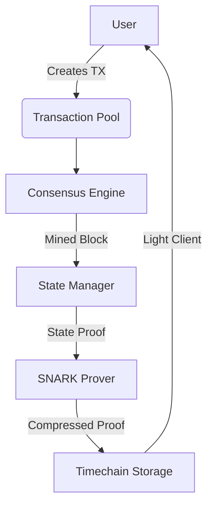
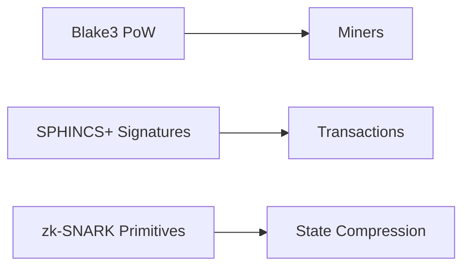
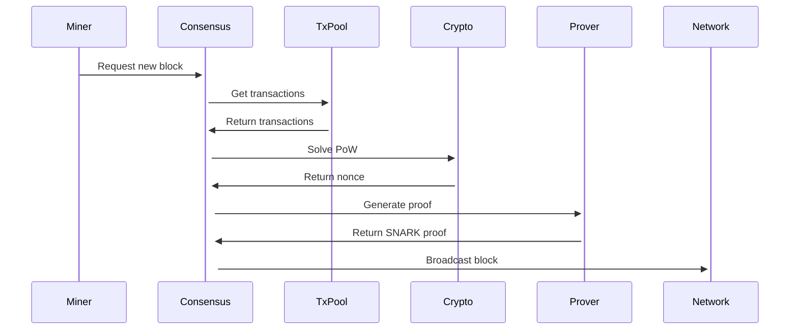
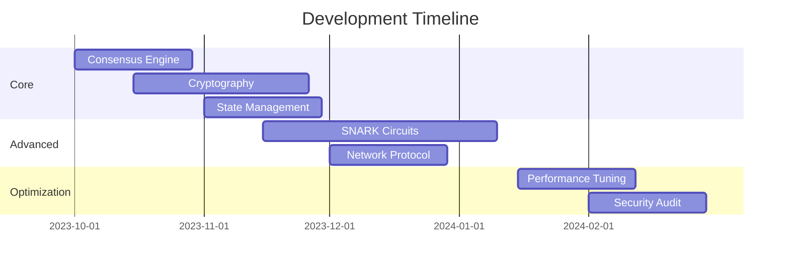

# Larity: Technical Specification Document



## Overview
Larity is a future considerate timechain protocol and network combining the following technologies:
- **DAGKnight consensus** for fast finality
- **Blake3 PoW** for quantum-resistant mining
- **SPHINCS+ signatures** for post-quantum security
- **zk-SNARKs** for state compression and scalibility
- **zk-SNARKs** for transactional privacy

## System Architecture

### Key Components
1. **Consensus Engine** - DAGKnight implementation
2. **Cryptography Core** - Blake3 and SPHINCS+
3. **State Manager** - Compressed state handling
4. **SNARK Prover** - Zero-knowledge proof generation
5. **Network Layer** - P2P communication
6. **Node Runtime** - System orchestration

## Codebase Structure

### Directory Tree
```
Larity-chain/
├── .cargo/              # Rust configuration
│   └── config.toml
├── crates/              # Core components
│   ├── consensus/       # DAGKnight implementation
│   │   ├── src/
│   │   │   └── lib.rs
│   │   └── Cargo.toml
│   ├── crypto/          # Cryptographic operations
│   │   ├── src/
│   │   │   └── lib.rs
│   │   └── Cargo.toml
│   ├── model/           # Data structures
│   │   ├── src/
│   │   │   └── lib.rs
│   │   └── Cargo.toml
│   ├── network/         # P2P networking
│   │   ├── src/
│   │   │   └── lib.rs
│   │   └── Cargo.toml
│   ├── node/            # Node runtime
│   │   ├── src/
│   │   │   └── main.rs
│   │   └── Cargo.toml
│   ├── prover/          # Proof generation
│   │   ├── src/
│   │   │   └── lib.rs
│   │   └── Cargo.toml
│   ├── snarks/          # zk-SNARK circuits
│   │   ├── src/
│   │   │   └── lib.rs
│   │   └── Cargo.toml
│   └── state/           # State management
│       ├── src/
│       │   └── lib.rs
│       └── Cargo.toml
├── .gitignore
├── Cargo.toml           # Workspace configuration
├── README.md
└── description.md       # This file
```

## Component Specifications

### 1. Consensus Engine (`crates/consensus`)
**Purpose**: Implements DAGKnight consensus with Blake3 PoW

```rust
pub struct DagKnightConsensus {
    dag: RwLock<BlockDag>,      // DAG structure
    pow_config: PowConfig,       // PoW parameters
    current_tip: AtomicU64,      // Current blockchain tip
}

// Key Functions
async fn mine_block(&self, txs: Vec<Transaction>) -> Block
fn verify_block(&self, block: &Block) -> bool
fn finality_check(&self, block_id: BlockHash) -> FinalityStatus
```

### 2. Cryptography Core (`crates/crypto`)
**Purpose**: Cryptographic primitives implementation



**Modules**:
- `pow.rs`: Blake3-based Proof-of-Work
- `signatures.rs`: SPHINCS+ implementation
- `merkle.rs`: Blake3-optimized Merkle trees

### 3. State Manager (`crates/state`)
**Purpose**: Manages compressed blockchain state

```rust
pub struct CompressedState {
    current_root: [u8; 32],              // Current state root
    proof_cache: LruCache<[u8; 32], SnarkProof>,  // Proof cache
}

// Key Functions
fn apply_block(&mut self, block: &Block) -> Result<[u8; 32]>
fn verify_proof(&self, proof: &SnarkProof) -> bool
fn get_state_proof(&self) -> SnarkProof
```

### 4. SNARK Prover (`crates/prover`)
**Purpose**: Generates zk-SNARK proofs

```rust
pub struct ProverService {
    state_circuit: StateTransitionCircuit,
    shielded_circuit: ShieldedTxCircuit,
    worker_pool: ThreadPool,  // Parallel proof generation
}

// Proof generation workflow
1. Receive block with transactions
2. Generate SPHINCS+ batch proof
3. Generate shielded transaction proof
4. Create recursive state proof
5. Compress and attach to block
```

### 5. Network Layer (`crates/network`)
**Purpose**: Manages P2P communication

**Protocol Features**:
- Gossipsub block propagation
- Kademlia DHT for state proof discovery
- Direct message channels for transaction forwarding

```rust
pub enum NetworkMessage {
    NewBlock(Block),             // Block propagation
    Transaction(Transaction),    // Transaction forwarding
    StateRequest(BlockHeight),   // State proof request
    StateResponse(SnarkProof),   // State proof response
}
```

### 6. Node Runtime (`crates/node`)
**Purpose**: System orchestration and event loop

```rust
pub struct LarityNode {
    consensus: Arc<DagKnightConsensus>,
    state: Arc<Mutex<CompressedState>>,
    tx_pool: TransactionPool,
    network: NetworkManager,
    prover_service: ProverService,
}

// Main event loop
async fn start(&self) {
    loop {
        select! {
            new_block = network.receive_block() => process_block(new_block),
            new_tx = network.receive_transaction() => process_transaction(new_tx),
            _ = consensus.mine_interval() => mine_block(),
        }
    }
}
```

## Key Workflows

### Block Mining Process


### Transaction Lifecycle
1. User creates transaction with SPHINCS+ signature
2. Transaction broadcasted to network
3. Miners include in candidate block
4. SNARK prover verifies signatures in-circuit
5. Block added to DAG with compressed proof
6. Light clients verify state with 50KB proof

## Performance Targets
| Metric | Target Value |
|--------|--------------|
| Block Time | 1 second |
| Finality | 2-5 seconds |
| Throughput | 500-1000 TPS |
| Block Size | < 50 KB |
| State Proof Size | 22 KB |
| Node Sync Time | < 1 minute |

## Development Roadmap


## Getting Started

### Prerequisites
- Rust 1.70+
- libclang (for SNARK dependencies)
- Protobuf compiler

### Building
```bash
# Clone repository
git clone https://github.com/yoshimakiro/Larityd.git
cd Larityd

# Build all crates
cargo build --release

# Run test node
cargo run -p Larity-node
```

### Configuration
```toml
[network]
bootnodes = ["/ip4/000.000.00.00/tcp/30333/p2p/12D3K..."]
port = 30333

[mining]
difficulty = 500000
threads = 4

[snark]
prover_threads = 8
proof_cache_size = 1000
```

## Future projects to be developed
Development & Testing Tools

1) A blockchain explorer interface to visualize your DAG structure and block propagation
2) A transaction generator/testing dashboard
3) A network monitoring tool to track node performance and consensus metrics

Wallet level

1) A wallet interface for Larity transactions
2) A developer portal with API documentation
3) A mining pool dashboard

Community & Marketing:

1) A project website showcasing the technical innovations
2) A testnet faucet for distributing test tokens
3) An educational dashboard explaining the quantum-resistant features

## Contribution Guidelines
1. Fork the repository
2. Create feature branch (`git checkout -b feature/amazing`)
3. Commit changes (`git commit -m 'Add amazing feature'`)
4. Push to branch (`git push origin feature/amazing`)
5. Open pull request


---
